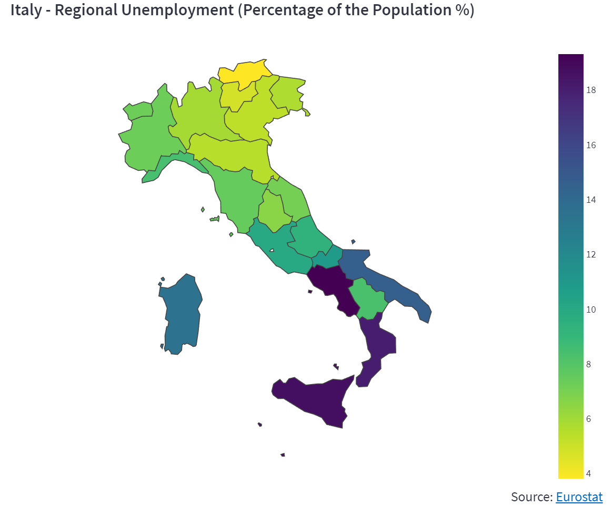

# StatsEuropa 📈

An interactive dashboard that provides statistical indicators and analysis about European Union countries, based on data from reliable sources sources like [Eurostat](https://ec.europa.eu/eurostat/web/main/home) and [Our World In Data](https://ourworldindata.org/). You can easily view the graph of your preference
by selecting an indicator, or visit the Analysis page for advanced statistics,
including linear regression modeling and principal component analysis. The dashboard has been deployed and
is available at [this link](https://www.statseuropa.com).

